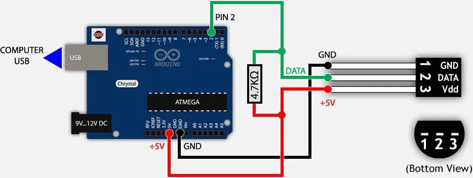

# smart-server-sensor

## Описание

Создание прошивки для микроконтроллера на основе RIOT OS, отправляющей данные на сервер и сам сервер-приёмник-обработчик.

Данный проект выполнялся для дисциплины "Программирование микроконтроллеров" на втором курсе обучения в институте.

## Используемые технологии

Сервер выполнен на `Flask` (python).

График сделан с помощью `plotly`

Микроконтроллер использовался с OS RIOT с датчиками температуры ds18.

## Варианты использования

Можно подключить неограниченное количество контроллеров через COM порты устройства.

К сожалению, подключение не через `USB` не было реализовано, однако вы можете найти её [здесь](old_files/ethernet_test.c). Она должна работать, но её придётся подправить для подключения `ethernet` или `wifi` модуля.

## Структура

### Сервер

#### Серверная составляющая

Простая инициализация таблиц с последующей отрисовкой страницы и обновлением. Дополнительно имеется функция обновления данных на странице.

#### Считывание данных с контроллера

При подключении контроллера по COM-порту к серверу происходит первичная инициализация контроллера, которая может быть использована для того, чтобы переподключать контроллеры, которые были временно отключены и для которых важны уникальные параметры (расположение и т. д.).

#### Графическая составляющая

Каждый тик отрисовывается среднее значение температуры по датчикам.

### Прошивка

Просто отправка данных на COM порт через `print` / `puts`.

### Подключение

При подключени датчика в режиме `1-Wire` необходимо подключать датчик следующим образом: 

## Командная работа

1. [**ARTEMII POPOVKIN**](https://github.com/Jrol123)
   - Тимлидер.
   - Продумал финальный вариант работы сервера и прошивки.
   - Модуль `read_port`.
2. [**ARTEM GROMYKO**](https://github.com/IAmSerepok)
   - Серверная часть.
   - Создание потока, настройка `Flask`-а
   - База данных.
3. [**Anonimous 2**](https://github.com/Tyferse)
   - Работа над прошивкой микроконтроллера.
   - Сначала делал с учётом `ethernet`.
4. [**Anonimous 3**](https://github.com/RezerdPrime)
    - Визуальная составляющая.
    - Графики, etc.
